# Application - Notion

Check the
[backend here](https://github.com/matheusjustino/notion-backend-csharp)!

## Resume

    This is Notion app clone.

## Information

**In this project were used:**
**`NextJs, NextAuth, TailwindCSS, Shadcn-ui, Zustand and EdgeStore`**. **as main
tools and technologies.**

## Application Screenshots

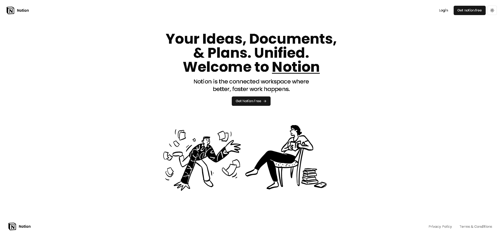

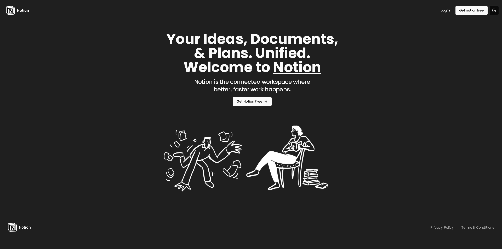

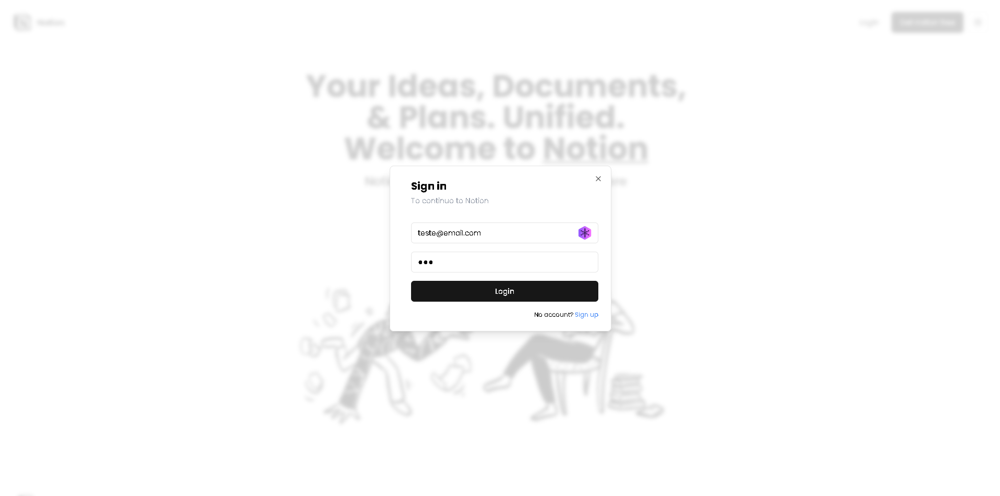

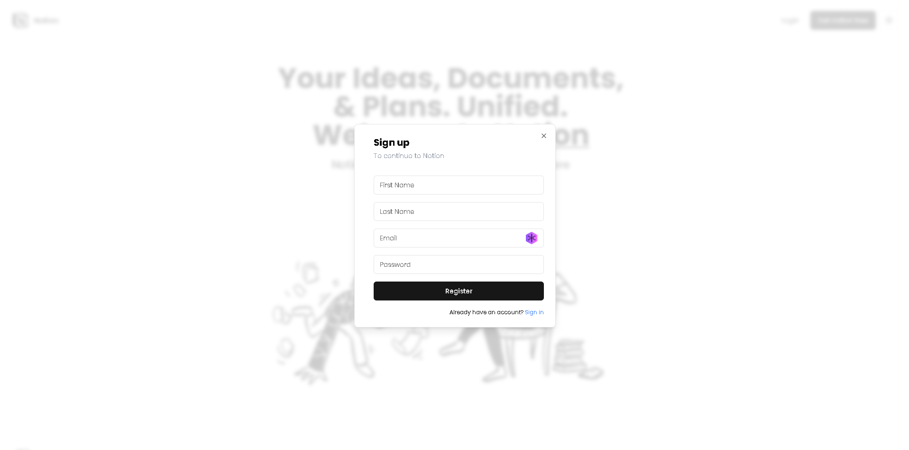

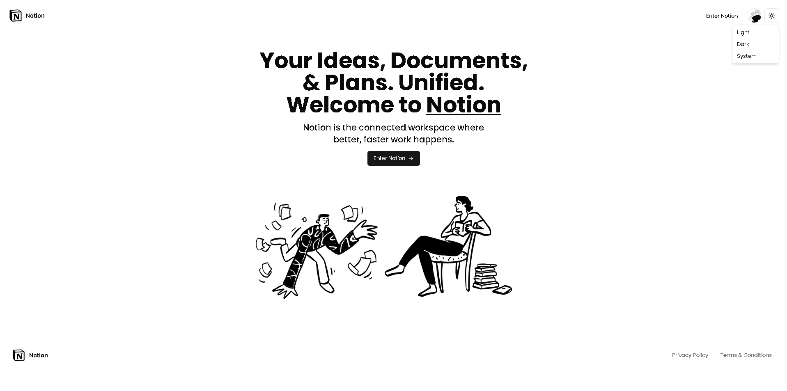

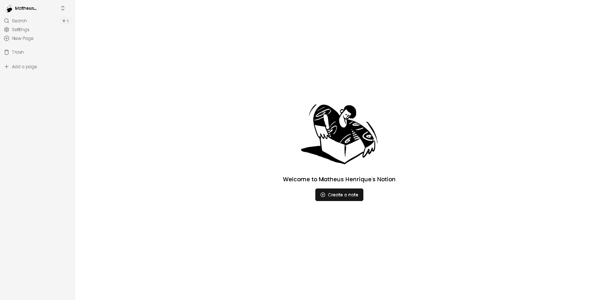

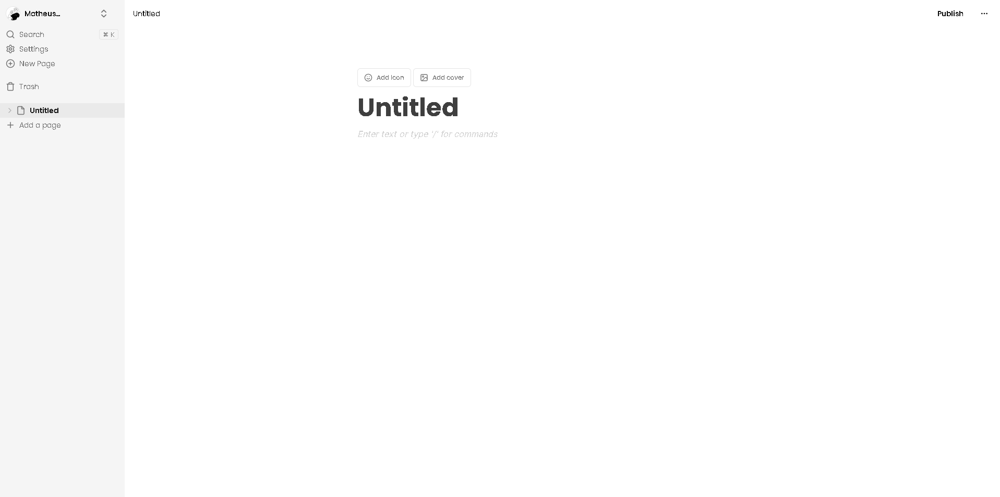

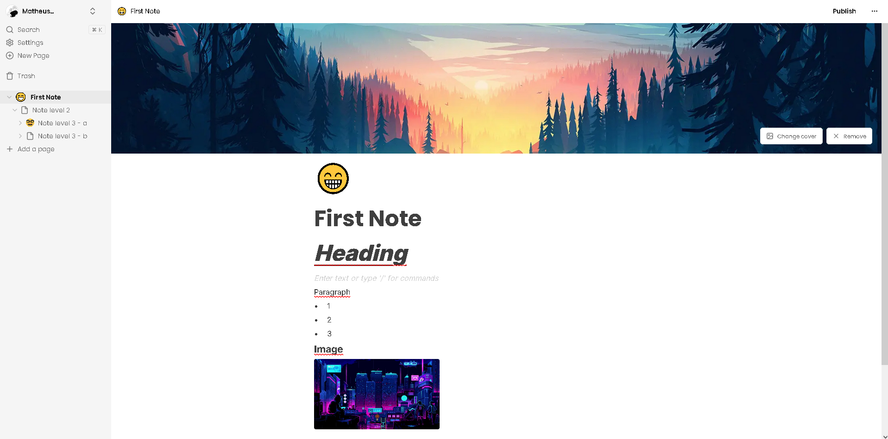

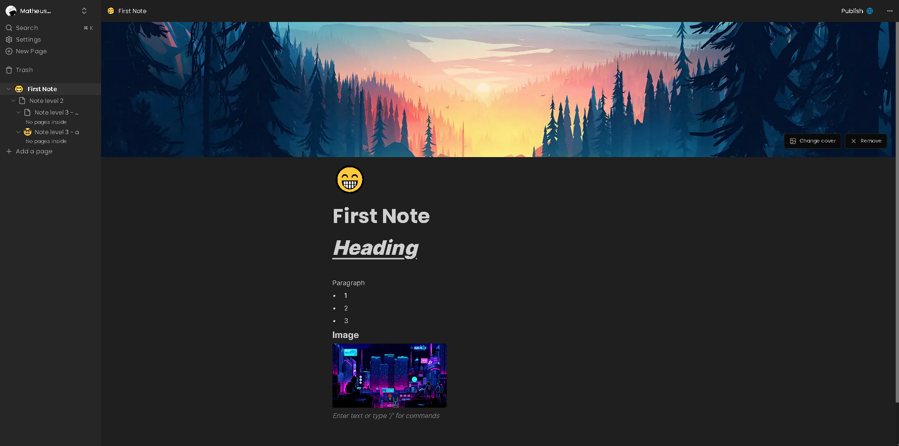

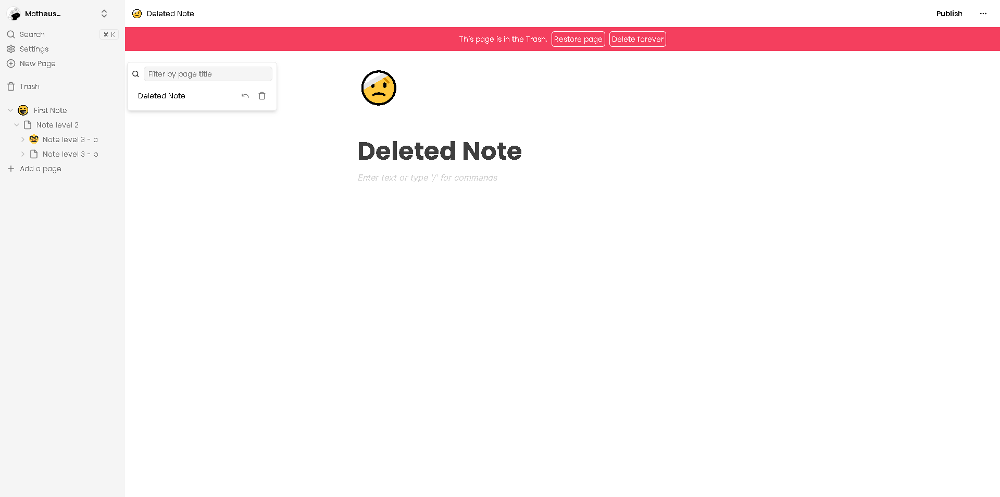

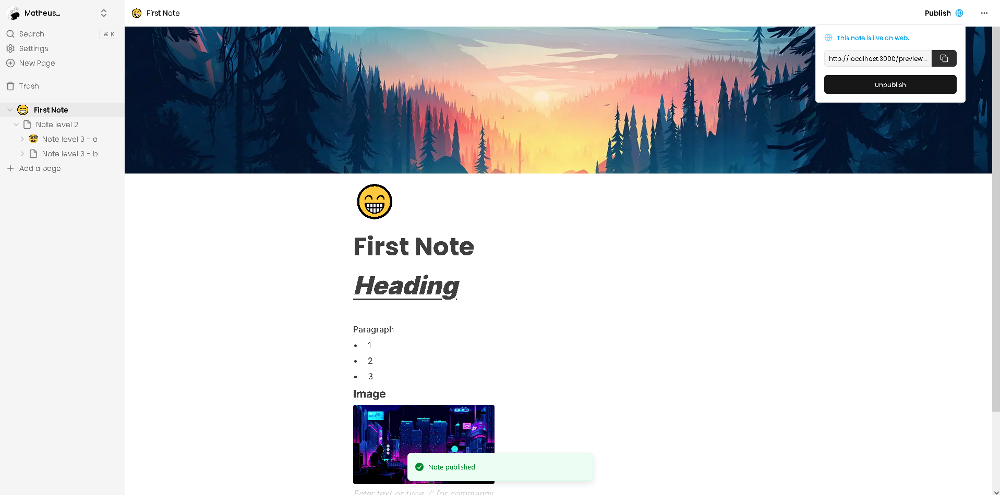

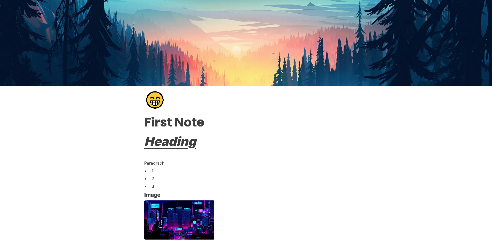
